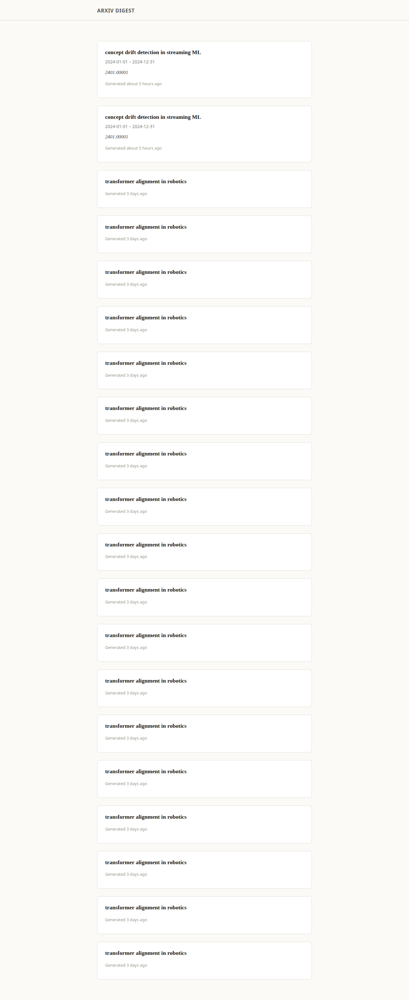
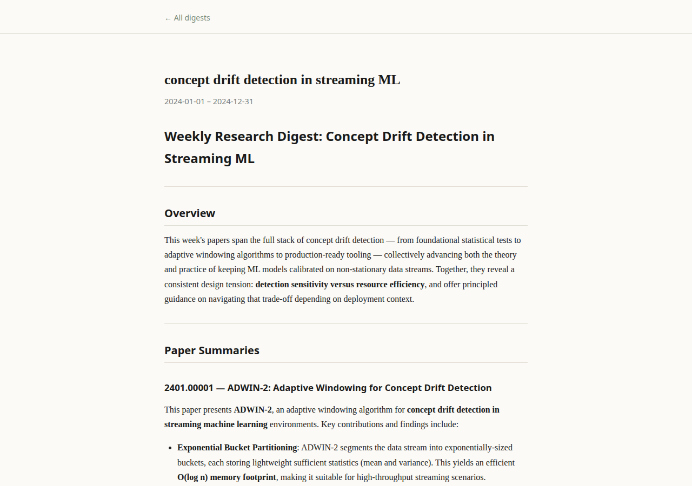
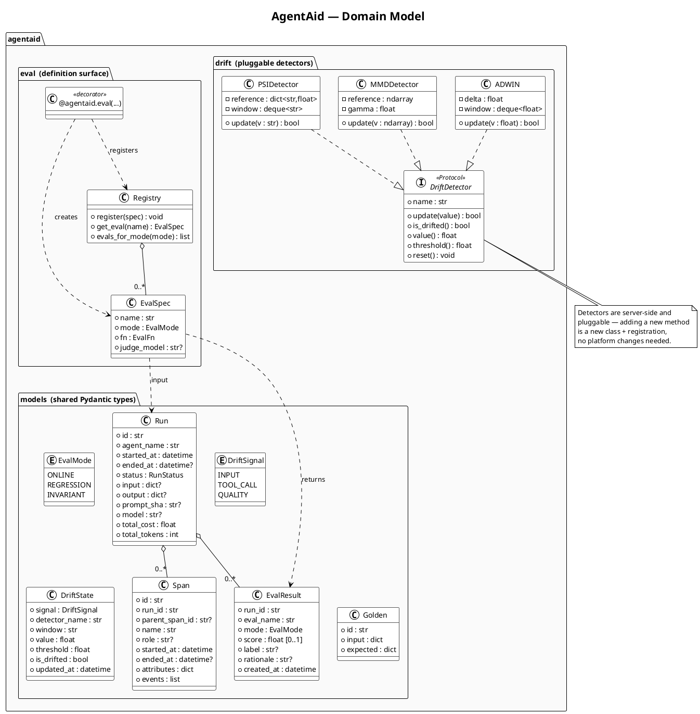
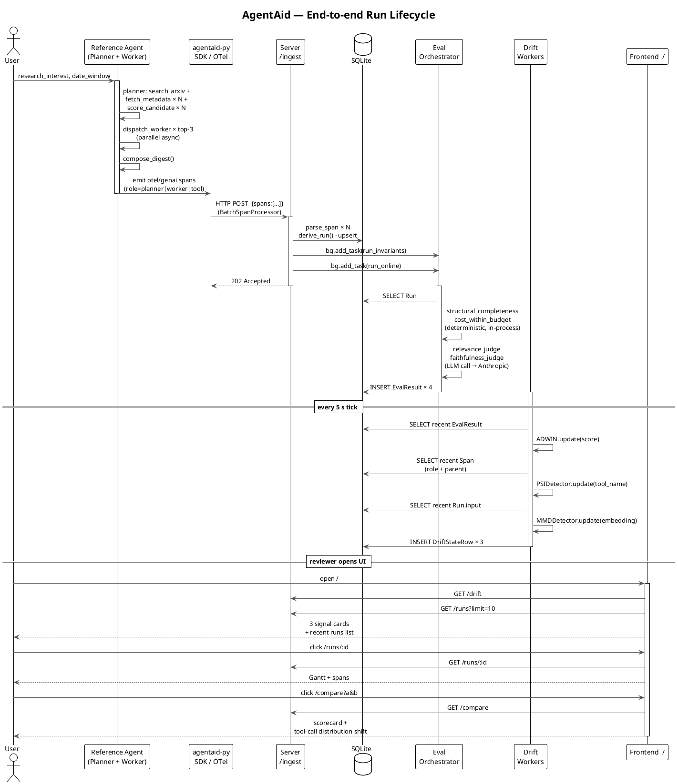
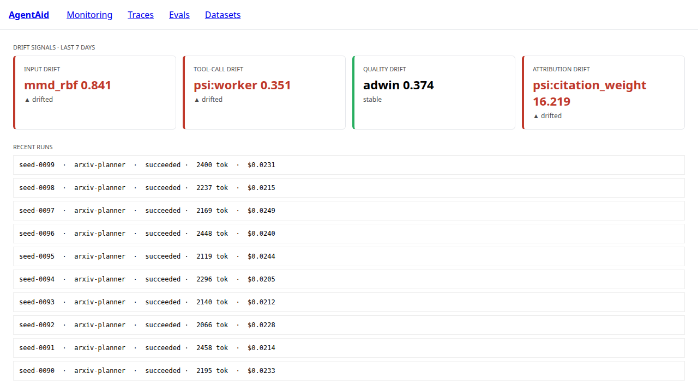
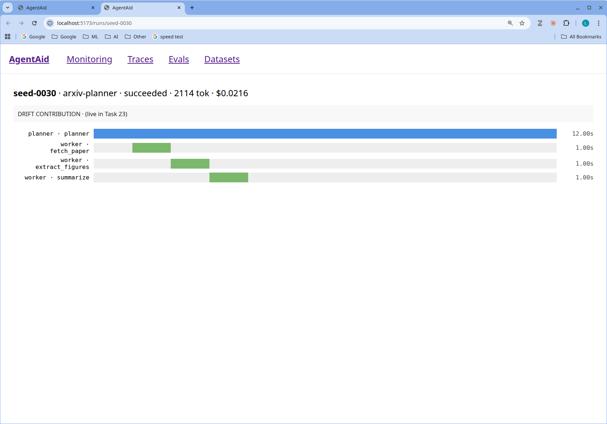
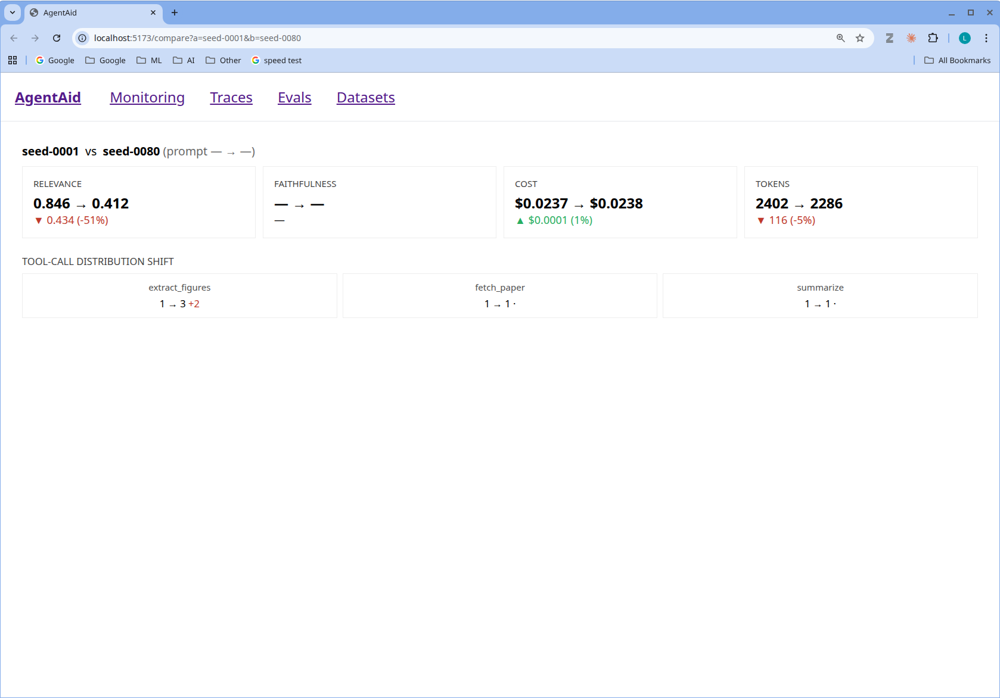

# AgentAid — project details

Companion to the top-level [`README.md`](README.md). Holds the narrative
material that doesn't need to be on the front door: stakeholder split,
design decisions, quick start, screenshots, scope boundaries, the
multi-tenant roadmap, and repository layout.

## Two surfaces, two stakeholders

Production AI agents have two audiences. The team running them needs traces,
drift, eval scores, regression diffs. The team consuming the output needs a
clean reading surface. AgentAid ships both as **deliberately separate apps**
— same database, separate API endpoints, different design languages — because
they answer fundamentally different questions.

| Surface | Audience | Stack | Routes | Visual identity |
|---|---|---|---|---|
| `agentaid-web` (platform) | Engineers, on-call, ML team | Vite + React + TS, dashboard density | `/`, `/runs/:id`, `/compare`, `/drift/:signal`, `/evals`, `/datasets` | Drift-first IA, monospace IDs, red/orange drift accents |
| `arxiv-digest-web` (consumer) | Researchers reading and initiating digests | Vite + React + TS, reading room | `/` (search form + digest list), `/digests/:run_id` | Serif body, max 720 px column, warm off-white, no top nav, muted accents |

Both consume the same AgentAid server, but through different API endpoints:
the platform reads `/runs`, `/drift`, `/compare`, etc.; the consumer surface
reads `/digests` and `/digests/:run_id`, posts to `/digests` to spawn a new
agent run, and pulls figure JPEGs from `/papers/:paper_id/figures/:filename`.
The consumer endpoints strip platform metadata (tokens, cost, prompt SHAs)
and shape the response for reading.

The consumer home page also carries a search form: a researcher types a
research interest plus a date window, and the server kicks off a fresh
agent run as a subprocess, polling-friendly status flows back through
the `GET /digests/:run_id` endpoint until the digest lands.

| Consumer list (`/`) | Consumer detail (`/digests/:id`) |
|---|---|
|  |  |

The deliberate separation is also the natural seam for a real distributed
deployment — see the [multi-tenant roadmap](#roadmap-toward-production-multi-tenant) below.

## Domain model and run lifecycle

| Domain model | End-to-end run lifecycle |
|---|---|
|  |  |

Sources: [`docs/diagrams/architecture.puml`](docs/diagrams/architecture.puml) ·
[`class.puml`](docs/diagrams/class.puml) ·
[`sequence.puml`](docs/diagrams/sequence.puml). Regenerate PNGs with
`java -jar plantuml.jar -tpng docs/diagrams/*.puml`.

## Why these choices

- **OTel + GenAI conventions** instead of a vendor format → reusable on any agent
  stack; the bare-SDK example proves it.
- **Pydantic AI** for the reference agent → typed end-to-end, async-native, thin
  enough to debug into and instrument cleanly.
- **Hand-rolled ADWIN/MMD/PSI** instead of `scikit-multiflow` → the math is
  visible and the dependency footprint stays small.
- **Citation-weight attribution** (FADMON-style, adapted for closed-weight LLMs) →
  computed at the agent layer from `PlannerResult.sections` length weights, persisted
  as `agentaid.attribution` on the root span and inside `run.output`, then
  PSI-compared against a frozen reference distribution by the attribution drift
  worker. Catches reasoning-source shifts that input/tool/quality drift miss.
- **Eval-first orchestration** → eval results are first-class typed objects;
  drift detectors subscribe to eval streams, so quality drift is wired to the
  same numbers a developer reasons about.
- **Polyglot SDK** (Python + TypeScript) → demonstrates parity in the platform's
  contract; both speak the same OTel/GenAI wire format.

## Quick start

```bash
make install
make server   # platform server   :8000
make web      # platform UI       :5173
make digest   # consumer UI       :5174  (reads /digests, no platform chrome)
uv run python scripts/load_golden.py
uv run python scripts/seed_drift.py   # makes drift visibly fire in the demo
```

Run the reference agent end-to-end against the AgentAid server:

```bash
AGENTAID_ENDPOINT=http://localhost:8000/ingest uv run python -m arxiv_agent
```

Run the bare-Anthropic-SDK example through the same ingestion pipeline:

```bash
AGENTAID_ENDPOINT=http://localhost:8000/ingest uv run python -m bare_sdk_example.example
```

Run a Mode 2 offline regression against the golden dataset:

```bash
curl -sS -X POST http://localhost:8000/regressions \
  -H 'content-type: application/json' \
  -d '{"dataset_id":"golden-arxiv-v1","prompt_sha":"HEAD","model":"claude-sonnet-4-6"}'
```

Then open `/datasets` to watch results stream in.

## Screenshots

| Drift home | Trace detail (Gantt) | Run comparison |
|---|---|---|
|  |  |  |

## Out of scope (deliberate)

| Out | Why |
|---|---|
| Multi-tenancy / auth | Single-developer dev tool. The architectural seams for an edge-agent + sanitised-egress + per-tenant data plane deployment are documented in [`docs/architecture/multi-tenant.md`](docs/architecture/multi-tenant.md). |
| Real-time WebSocket streaming | Polling is sufficient for the demo. |
| Drift methods beyond ADWIN/MMD/PSI | Plugin interface designed for additions; demonstrating the interface matters more than method count. |
| Mobile-responsive UI | Reviewer is on a desktop. |
| Live deployment | Replaced by the recorded walkthrough above. |
| Prompt-versioning UI | Prompts are code, versioned in git, surfaced as SHAs. UI for editing them is low ROI. |
| OpenAI provider | Anthropic-only; OTel/GenAI conventions and the bare-SDK example carry the framework-agnostic claim. |

## Roadmap toward production multi-tenant

AgentAid's current architecture is single-tenant by design — it's a
single-developer dev tool. The architectural seams it has, however, are
already the right shape for a real distributed deployment: customers run
agents and consumer UIs on-premises; the AI-company provider runs a
multi-tenant control plane in the cloud; the SDK exporter is the natural
egress filter for content redaction; per-tenant data isolation is a
server-layer concern, not a rewrite.

The full design — boundaries, redaction policy, mTLS / scoped API keys,
per-tenant data plane, edge eval LLM judges — is in
[`docs/architecture/multi-tenant.md`](docs/architecture/multi-tenant.md).
That document also enumerates what AgentAid already has versus what would
need to change, with rough effort estimates.

## Repository layout

```
agentaid/
├── packages/
│   ├── agentaid-py/         # Python SDK: otel exporter, eval framework, drift detectors
│   ├── agentaid-ts/         # TypeScript SDK: otel exporter, eval define, invariants
│   ├── agentaid-server/     # FastAPI server: ingestion, evals, drift workers, regression
│   ├── agentaid-web/        # Vite + React + TS — platform UI (engineers)
│   ├── arxiv-digest-web/    # Vite + React + TS — consumer UI (researchers)
│   ├── reference-agent/     # Pydantic AI arXiv agent + mock arXiv layer
│   └── bare-sdk-example/    # Bare Anthropic SDK + manual otel — framework-agnostic proof
├── eval/golden/             # 10-row curated dataset for Mode 2 regression
├── scripts/
│   ├── load_golden.py             # Seeds golden dataset into the server
│   ├── seed_drift.py              # Synthetic drift seed for demos
│   ├── run_demo.py                # Scripted demo driver
│   ├── record_walkthrough.py      # Playwright auto-recording of the platform UI tour
│   ├── add_captions.py            # Burns product-description + skill captions into the video
│   ├── capture_digest_screens.py  # Playwright capture of consumer-UI screenshots
│   └── make_gif.sh                # ffmpeg two-pass palette → GIF
├── docs/superpowers/        # Design spec + implementation plan
└── docs/architecture/       # Production-shaped design notes (multi-tenant)
```

See `docs/superpowers/specs/2026-05-06-agentaid-design.md` for the full design,
and `docs/superpowers/plans/2026-05-06-agentaid-implementation.md` for the plan
that produced this implementation.
