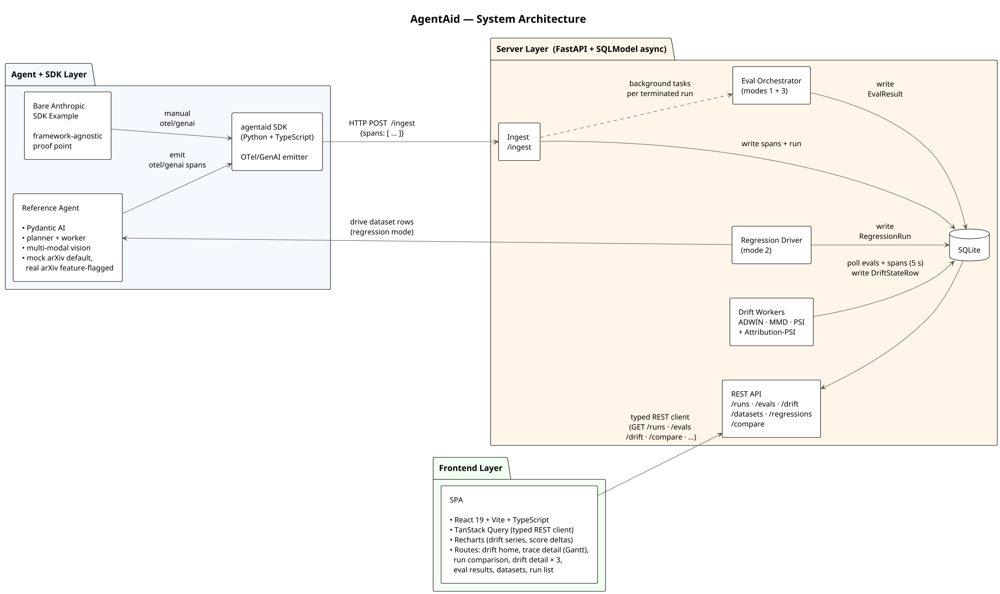

# AgentAid

> An information searching tool and a drift-aware observability and evaluation platform for production AI agents.
> Beyond standard traces and metrics, it treats distribution shift across inputs, tool-call patterns, eval scores, and citation attribution as first-class monitoring signals. Application-agnostic and front-end independent.

*Full-resolution recording: [`docs/walkthrough.mp4`](docs/walkthrough.mp4)*

The bundled multi-agent arXiv research assistant (planner + worker, multi-modal
figure extraction) is the reference workload — exercising the platform on
real-shaped traffic and driving the walkthrough above.

**Stack:** Python · FastAPI · SQLModel async · Pydantic AI · Anthropic SDK ·
OpenTelemetry / GenAI · TypeScript · React 19 · Vite · TanStack Query · Recharts.

## Architecture

Three layers, OTel/GenAI at the seam between them:

1. **Agent + SDK layer** — Pydantic AI reference agent and a bare-Anthropic-SDK
   example. Both emit OTel/GenAI spans via the `agentaid` Python or TypeScript SDK.
2. **Server layer** — FastAPI + SQLModel + SQLite. Ingests spans, runs LLM-judge
   evals async, runs four drift-detector workers on a 5-second tick.
3. **Frontend layer** — two Vite + React + TS apps: `agentaid-web` for the
   platform (engineers) and `arxiv-digest-web` for consumers (researchers).

## Future improvements

- **Retry + backoff + timeout on LLM calls.** Currently agent failures are shown in the UI,
- add bounded retries and hard timeout on `agent.run()`.
- **Embedding-based attribution** - catch where the agent has paraphrased from a source rather than citing it directly.
- **Reflexion / in-loop self-critique.** Agent judges currently run after the agent's finished, get the agents to judge its own work mid-run and self-correct before producing a final answer.
- **Pairwise / rank-based judging** - instead of scoring a single run in isolation ("this scores 7/10"), compare two runs against each other ("run A is better than run B at citing sources"). Could be more reliable because it's easier to judge relative quality than absolute quality.
- **Production multi-tenant build-out** - make the platform usable by multiple separate customers at once, where each customer's data is kept isolated, the agent runs at the edge (closer to the user), and anything leaving the system has sensitive information stripped out first.
- **Real-time WebSocket trace streaming** instead of 5-second polling.
- **Additional drift methods**

More detail in [`DETAILS.md`](DETAILS.md).

## License

MIT.
